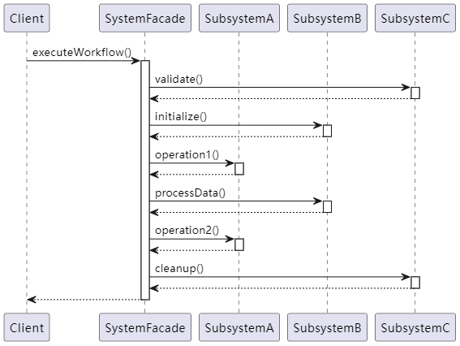

# UNL类图


#### 核心元素说明：
| 元素                | 说明                                                                 |
|---------------------|--------------------------------------------------------------------|
| **Client**          | 客户端类，直接调用外观接口                                         |
| **SystemFacade**    | 外观类，聚合子系统并封装调用逻辑                                   |
| **SubsystemX**      | 子系统类（A/B/C），实现具体功能                                   |
| 空心箭头            | 依赖关系（Client依赖Facade）                                       |
| 实心菱形箭头        | 组合关系（Facade拥有子系统对象）                                   |

#### 关系图解：
1. **客户端调用**：Client -> SystemFacade
2. **子系统聚合**：SystemFacade组合管理SubsystemA/B/C
3. **接口封装**：Facade方法内部编排子系统方法调用顺序

___

# 配套序列图（流程演示）


___

# 编译方法
```
g++ -std=c++17 -o facade facade.cpp
```
___

# 预期输出：
```
=== 系统工作流开始 ===
SubsystemC: 验证输入
SubsystemB: 初始化系统
SubsystemA: 执行操作1
SubsystemB: 处理数据
SubsystemA: 执行操作2
SubsystemC: 清理资源
=== 系统工作流完成 ===

[快速模式]
SubsystemB: 初始化系统
SubsystemA: 执行操作1
SubsystemB: 处理数据
```

---

# 使用价值


| 优势 | 说明 |
|-------|-------|
| **简化接口** | 将多个子系统的复杂调用简化为1-2个高层接口 |
| **降低耦合** | 客户端与子系统完全解耦，只需依赖外观类 |
| **流程封装** | 封装典型工作流程，确保执行顺序正确性 |
| **维护友好** | 子系统修改只需调整外观类，不影响客户端 |
| **渐进增强** | 可通过添加新外观类支持不同使用场景 |

---

# 实用场景

**典型使用案例**：
1. **复杂系统初始化**：需要按特定顺序初始化多个模块
2. **跨系统操作**：涉及多个子系统的数据转换/传输场景
3. **流程编排**：需要组合多个子系统操作的业务流程
4. **API网关**：为微服务系统提供统一入口
5. **遗留系统封装**：包装旧系统提供现代化接口

**行业应用示例**：
- 电商系统：封装订单创建（库存、支付、物流）
- 游戏引擎：简化渲染管线（模型、材质、光照）
- 物联网系统：统一设备控制接口（传感器、网络、存储）
- 编译器设计：封装词法分析、语法分析、代码生成
- 金融系统：组合交易验证、风控、清算流程

---

# 模式扩展建议

1. **参数配置**：
```cpp
class SystemFacade {
public:
    void executeWorkflow(const Config& config) {
        if(config.debugMode) subsystemC.validate();
        // ...
    }
}
```

2. **异步处理**：
```cpp
void asyncExecute() {
    std::async([this]{ 
        this->executeWorkflow();
    });
}
```

3. **组合模式**：
```cpp
class EnhancedFacade : public SystemFacade {
    void advancedWorkflow() {
        // 添加新的子系统调用
    }
}
```

---

# 设计注意事项

**推荐使用场景**：
- 需要简化复杂子系统调用时
- 系统存在多个相互关联的模块时
- 需要为不同用户提供不同抽象层级时

**不推荐场景**：
- 需要直接访问子系统高级功能
- 系统非常简单无需分层
- 需要动态切换不同实现（应结合抽象工厂）

---

这个模板可直接用于新项目开发，通过以下步骤适配：
1. 将`SubsystemA/B/C`替换为实际子系统
2. 在`executeWorkflow()`中编排实际业务流程
3. 添加必要的异常处理和日志记录
4. 根据需求扩展接口参数和返回类型
