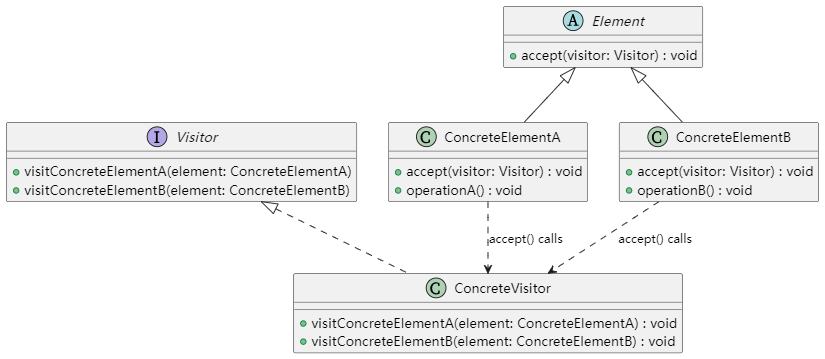

# UML类图


## 说明
- Visitor：抽象访问者接口，定义了对 ConcreteElementA 和 ConcreteElementB 的访问操作。
- Element：抽象元素接口，声明了 accept() 方法。
- ConcreteElementA / ConcreteElementB：具体元素类，实现了 accept() 方法并提供自己的业务操作（如 operationA、operationB）。
- ConcreteVisitor：具体访问者类，实现了 Visitor 接口，对不同的元素执行具体操作

## 编译方法
```
g++ -std=c++11 -Wall -o visitor visitor.cpp
```

# 实际应用场景与使用价值
## 实际应用场景：

- 编译器中的语法树遍历 \
在编译器中，语法树（AST）的各个节点需要执行不同的操作（如语义分析、代码生成、优化等）。使用访问者模式可以将对各个节点的操作封装到独立的访问者中，而不修改节点类本身。

- 文档处理系统\
文档或 XML/HTML 的节点结构中，可能需要执行不同的统计、格式化或转换操作，访问者模式可以统一遍历节点结构并对不同节点执行相应操作。

- 对象结构的报告生成 \
当需要对复杂对象结构生成各种不同格式的报告时，可以通过访问者模式分离报告生成算法与对象数据结构，实现灵活扩展。

## 使用价值：

- 符合开闭原则 \
访问者模式允许在不改变元素类的前提下增加新的操作，只需添加新的访问者类即可，减少了对已有类的修改。

- 清晰的分离 \
将操作算法与对象结构分离，使得算法独立于对象数据结构，便于维护、扩展和测试。

- 集中控制 \
访问者模式将与元素操作相关的代码集中到访问者中，降低了各元素类内部的复杂性，并且可以方便地管理和组合各种操作。