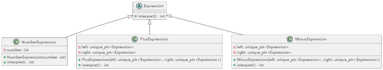

# UML类图


## UML 类图说明：
- Expression：抽象表达式类，定义了纯虚函数 interpret()，所有表达式都必须实现该方法。
- NumberExpression：终结符表达式，用于存储数字，其 interpret() 返回存储的数字。
- PlusExpression 与 MinusExpression：非终结符表达式，分别表示加法和减法操作，通过组合左右子表达式来计算结果。

# 编译方法
```
g++ -std=c++17 -Wall -o interpreter interpreter.cpp
```

# 实际应用场景与使用价值
## 实际应用场景：

- 领域特定语言 (DSL)\
当需要为某一特定领域设计一个专用语言（如配置文件、脚本语言、规则引擎）时，解释器模式可以将语言的文法与解析逻辑分离，并解释执行用户输入的命令或表达式。

- 编译器和解释器\
解释器模式在编译器中广泛应用，用于解析抽象语法树（AST）中的节点，并执行语义分析、代码生成等操作。

- 表达式求值\
在计算器或数学表达式求值程序中，通过构造表达式树并使用解释器模式动态计算表达式的值。

## 使用价值：

- 分离文法与解释逻辑\
解释器模式将语言的语法规则与解释执行的逻辑分离，使得语言扩展和维护更为灵活。

- 易于添加新操作\
通过扩展新的表达式类，可以增加对语言中更多语法的支持，而不需要修改已有代码，符合开闭原则。

- 灵活的动态解释\
解释器模式能够在运行时动态解析和执行表达式，适合需要频繁变化和扩展的场景。