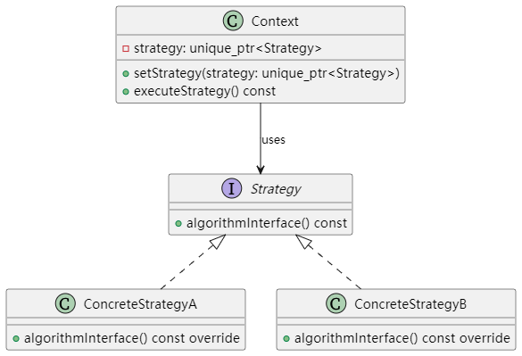

# UML类图


# 编译方法
```
g++ -std=c++17 -Wall -o strategy strategy.cpp

```

# 实际应用场景与使用价值
## 实际应用场景：

- 排序算法选择\
    在需要对数据进行排序时，可以将不同的排序算法（如快速排序、归并排序等）封装为不同的策略，根据数据规模或数据特性动态选择合适的排序算法。

- 路径规划\
在导航系统中，不同的路径规划算法（最短路径、最快路径、最省油路径等）可以作为策略封装，用户根据需求选择合适的算法计算路线。

- 支付方式选择\
在电子商务系统中，不同的支付方式（信用卡、支付宝、微信支付等）可以封装成不同的策略，用户支付时可根据需要选择相应的支付策略。

## 使用价值：

- 提高灵活性 \
策略模式使得算法之间可以互换，客户端可以在运行时动态选择最合适的算法，而不需要修改客户端代码。

- 符合开闭原则 \
当需要引入新的算法时，只需增加一个新的策略类，而不必修改原有代码，实现了系统的扩展而不影响原有系统的稳定性。

- 降低耦合度 \
将算法封装在独立的策略类中，使得上下文类与具体算法的实现解耦，便于维护和测试。