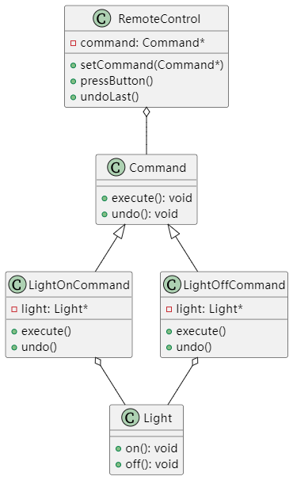

# UML类图


# 编译方式
```
g++ -std=c++17 -o command command.cpp
```

# 使用场景
- 需要将操作参数化（如GUI按钮操作）
- 需要支持事务操作（支持撤销/重做）
- 需要将操作排队执行或记录操作日志
- 需要支持宏命令（组合命令）
- 需要解耦请求发送者和接收者

# 使用价值
- **解耦性**：将调用操作的对象与知道如何实现操作的对象解耦
- **可扩展性**：可以轻松添加新的命令而不影响现有代码
- **复合命令**：可以创建组合命令（宏命令）
- **撤销/重做**：通过维护命令历史实现撤销/重做功能
- **队列支持**：可以将命令对象放入队列实现延迟执行
- **事务支持**：适用于需要实现原子操作的场景