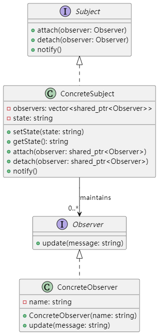

# UML类图


## UML 图描述如下：

- **Subject（接口）**：定义了 attach()、detach()、notify() 方法。
- **ConcreteSubject**：实现了 Subject 接口，内部维护一个观察者列表以及自身状态，通过setState() 更新状态后调用 notify() 方法通知所有观察者。
- **Observer（接口）**：定义了 update() 方法。
- **ConcreteObserver**：实现了 Observer 接口，根据主题状态更新自己的行为。

# 编译方法
```
g++ -std=c++17 -Wall -o observer observer.cpp

```

# 实际应用场景和使用价值
## 实际应用场景：

## 事件驱动系统
GUI 应用程序、实时系统、游戏等需要处理用户交互事件或状态变化时，采用观察者模式可以将事件产生者（主题）与多个事件处理者（观察者）解耦。

## 消息广播与订阅
在分布式系统或消息中间件中，观察者模式可以用于实现发布/订阅机制，动态通知各个订阅者状态更新。

## 数据绑定
在 MVC 或 MVVM 架构中，模型变化时通知视图更新是观察者模式的典型应用。

## 使用价值：

## 降低耦合性
主题和观察者之间通过抽象接口解耦，便于独立扩展和维护。

## 动态响应
当主题状态变化时，所有注册的观察者都会被自动通知，保证系统各部分能及时响应状态更新。

## 扩展性好
增加或移除观察者操作简单，不影响主题和其他观察者的功能，符合开闭原则。