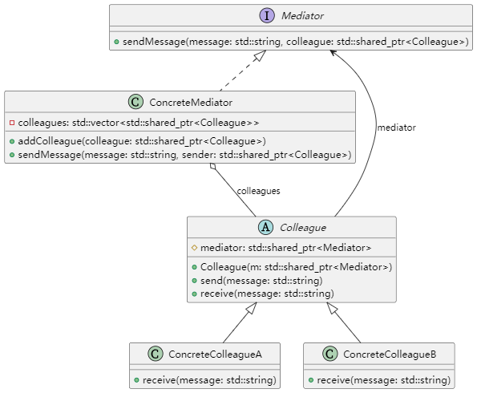

# uml类图


# 编译方法
```
g++ -std=c++11 -o mediator mediator.cpp
```

# 实际应用场景
- **GUI 框架:**\ 
​在图形用户界面开发中，中介者模式用于协调各个组件（如按钮、文本框、列表等）之间的交互，避免组件之间的直接引用，提升模块化程度。​

- **聊天系统:**\
​在即时通讯应用中，中介者模式可以用来管理用户之间的消息传递，服务器作为中介者，负责将消息从发送者转发给接收者。​

- **航空交通管制：**\
​在航空系统中，塔台作为中介者，协调各个飞机的起飞、降落和航行，避免飞机之间的直接通信，确保航空安全。

# 使用价值：
- **降低耦合度：**\
​通过引入中介者，对象之间不再直接引用，减少了系统中对象之间的依赖关系，提升了系统的可维护性和扩展性。​

- **简化对象交互：​** \
将复杂的对象交互逻辑集中到中介者中，简化了对象之间的通信，使系统结构更加清晰。​

- **提高灵活性：** \
​可以更方便地增加或修改对象之间的交互行为，而无需修改各个对象本身，符合开闭原则。