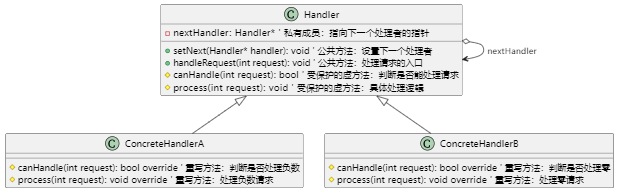

# UML类图

## 关键元素说明
- **Handler 抽象处理者**

    - 核心成员
nextHandler: Handler*：指向链中下一个处理者的指针，形成链式结构。

- 核心方法

setNext()：动态设置下一个处理者，支持链的灵活构建。

handleRequest()：处理请求的核心逻辑，依次尝试当前节点或传递给下一节点。

canHandle() 和 process()：由子类实现的虚方法，分别用于判断和处理请求。

ConcreteHandlerA/B 具体处理者

职责

继承自 Handler，实现 canHandle() 和 process() 方法，定义自己的处理逻辑。

示例规则

ConcreteHandlerA：处理负数请求。

ConcreteHandlerB：处理零请求。

（可扩展更多处理者，如 ConcreteHandlerC 处理正数请求。）

箭头关系说明

继承关系 `<|--

表示具体处理者（子类）继承抽象处理者（父类）。

关联关系 `o-->

表示 Handler 类持有下一个 Handler 对象的指针，形成链式结构。