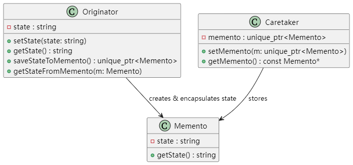

# UML类图


## 说明
- **Originator**：发起人类，负责设置和获取内部状态，提供保存状态到 Memento（备忘录）以及从 Memento 恢复状态的功能。
- **Memento**：备忘录类，用于封装 Originator 的状态。
- **Caretaker**：看护者类，仅负责存储 Memento 对象，不对其内容进行操作。

# 编译方法
```
g++ -std=c++17 -Wall -o memento memento.cpp
```

# 实际应用场景和使用价值
## 实际应用场景：

- 撤销/重做功能 \
在文本编辑器、绘图软件或其他需要撤销/重做操作的应用中，可以利用备忘录模式保存用户操作前的状态，当用户执行撤销操作时，从备忘录恢复到先前状态。

- 游戏存档 \
在游戏中保存玩家的状态（如关卡、得分、装备等），当玩家需要回退或重新加载时，可以通过备忘录模式恢复到之前的游戏状态。

- 系统配置回滚 \
在一些系统中，配置修改后如果出现问题，可以通过备忘录模式保存之前的配置，并在必要时进行回滚。

## 使用价值：

- 封装性\
备忘录模式在不破坏封装的前提下捕获对象内部状态，使得对象的私有状态可以被保存和恢复，而无需暴露内部细节。

- 易于扩展 \
当系统需要增加撤销/重做功能或状态恢复功能时，备忘录模式提供了一种简单的解决方案，符合开闭原则。

- 简化复杂操作 \
通过将状态保存与恢复的逻辑集中在 Memento 类中，可以简化客户端对复杂状态管理的处理。