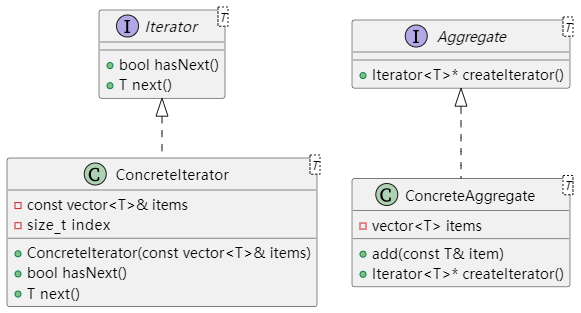

# UML类图


## 说明：
- Iterator 接口 定义了遍历聚合对象时需要的方法。
- Aggregate 接口 定义了创建迭代器的方法。
- ConcreteIterator 具体实现了遍历逻辑，并维护一个索引来记录当前位置。
- ConcreteAggregate 内部使用 std::vector 存储数据，并通过 createIterator() 方法返回一个具体迭代器实例。

# 编译方法
```
g++ -std=c++11 iterator_pattern.cpp -o iterator_pattern

```

# 使用价值与实际价值
## 使用价值：
- 解耦集合与遍历算法： 迭代器模式将遍历逻辑与集合内部数据结构分离，使得集合的内部实现可以自由变化而不影响客户端代码。

- 统一接口： 客户端只需通过统一的迭代器接口来遍历各种不同类型的聚合对象，提升了代码的复用性和扩展性。

- 安全性： 不暴露内部实现细节，增强了封装性和安全性，防止了外部直接操作集合数据。

## 实际价值：
- 简化代码： 在复杂系统中，不同的数据集合可能采用不同的内部数据结构，使用迭代器模式可以统一遍历操作，减少重复代码。

- 灵活性： 可以在不修改集合类的情况下，改变或扩展遍历方式。例如，支持正向、逆向遍历或者其他定制的遍历策略。

- 维护性： 当需要修改内部数据结构时，不需要同步修改所有使用遍历逻辑的代码，降低了维护成本。